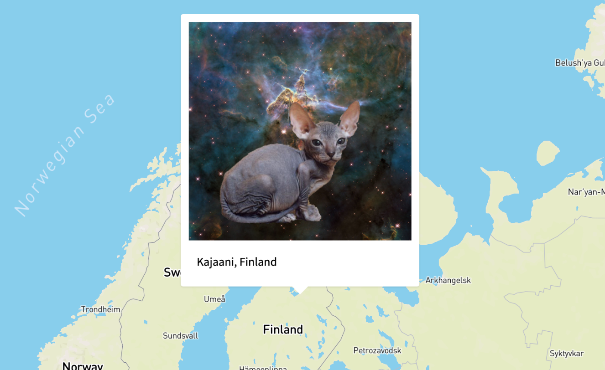

# serverless-api-gateway-websockets
Example of how to broadcast Websocket messages using the Serverless framework, Lambda and API Gateway.

Article breaking down how it works, and lessons learned: 
https://www.thatapicompany.com/blog/serverless-api-gateway-websockets

